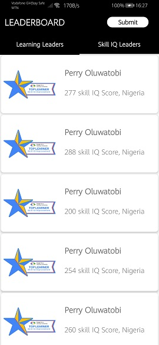
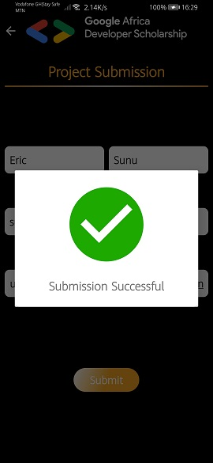

# GADS-Leaderboard-Mobile-Application
This project is a very simple Android Project aimed at getting you to implement some simple concepts that are very important as far as Android Development is concerned.  In this project, you are going to implement a mobile design of the GADS 2020 Leaderboard. The mobile App will display Top 20 learners in the Learning Leaders’ category and Top 20 learners in the Skill IQ Leaders’ category.  This project will help you understand: Multi-Activity Project, View pager, Customizing Toolbar, RecyclerView, Making Network Request, Working with Google Form and many more...

Below are the screenshots of the app;

 
 

